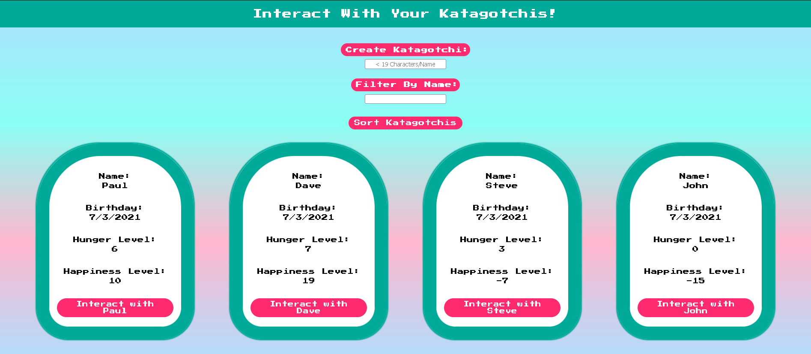

# Tamagotchi Front End

## https://tamagotchi-front-end-bgrap.netlify.app/

I built this application as part of my course work at Suncoast Developers Guild. It relies on my TamagotchiAPI, which I've pinned as well. It was really rewarding to use everything we learned about the front end and an application we'd previously built during the back-end unit to build something fun.

Enjoy!

And be nice to your ~ katagotchis ~

They get lonely and hungry...

<!-- - Add some new fields to your pet. Perhaps a string-based URL of an image of the pet to display beside its name. ->> daily kitteh API
- placeholder Keanu worked nicely -->

<!-- DONE -->

<!-- -spacing on pet page -->
<!-- -margins on headstones -->

<!-- - stop footer from climbing on all pages with extreme zoom out -->

<!-- DONE -->
<!--
- add local storage option to take user to last pet page they visited

- add session storage for last sort option on main page

- add set timout where needed in input boxes

- connect to an API to get random pictures and display in pet pages, as opposed to stock imagery

- add sound effects when interacting with pet, when pet dies, and when pet created

- add media queries for pet page to adjust size of text and buttons

- add death date to API and adjust headstones to include birthday - death date

- update hunger on a daily basis in API

- DRY process with JS

- clean up css, add nesting (and class structure to html)

<!-- - add media queries to make all pages extremely responsive -->

<!-- - should add some styling so the user knows how the list is being sorted, possibly by changing the font color of active buttons -
--fix color change resets -->

<!-- Done -->

<!-- - use grid and media queries to reorganize pet list and graveyard -->

<!-- DONE -->

<!-- - work on contrasting make buttons a darker pink and boxes around white text darker teal to improve contrast, make p text darker as well -->

<!-- DONE -->
<!--
    <!-- - Once you have successfully deployed your application: Use the Insomnia app to work with your API. At a minimum, use your API endpoints to create and list your Pets -->

<!-- Explorer Mode --

    - Have fun with the styling. Make your CSS neat and presentable, but apply your creativity!

    - The home page should show a list of all the pets in your API. The listing should include their name, birthday, hunger level, and happiness level.

<!-- DONE     --

    - Add a form to your home page to input a new pet's name and use your "CREATE" API to make a new pet. The list of pets should refresh.

<!-- DONE     --

    - Make each pet on the home page a <Link> to a page showing the pet's detail. The detail page should show the name, birthday, hunger level, and happiness level.

<!-- DONE     --

    - On the detail page, add buttons to:
     -  Play with the pet
     +

<!-- DONE     --

     -  Feed the pet

     <!-- DONE     --

     -  Scold the pet

<!-- DONE     --

    - After each of the above actions, reload the data for the pet (use React to do this, NOT a force page reload)

<!-- DONE     --

    - Add a button to delete a pet. After deletion, redirect the user to the home page

<!-- DONE     --

    - Add a link on the detail page to navigate to the home page.

<!-- DONE     --

    - DEPLOY your front end and test it on your netlify version.

<!-- DONE     --

    - SHARE it with friends and brag about how you created the entire code for this.

<!-- Adventure Mode --

    - Add some new fields to your pet. Perhaps a string-based URL of an image of the pet to display beside its name.

    -> Daily Kitteh API

    - Add a "search" field on the home page. When the user types in that field, dynamically update the pet list only to include pets whose name includes the input text.

<!-- DONE     --

    - Ensure the pets on the home page are sorted by their NAMES. You could implement this in the FRONT END or the BACK END.

    (Look into localeCompare and sort info in sdg quick reference guide)

<!-- DONE     -->

<!-- Epic Mode --

    - Add a user interface on the home page to sort your pets by their name, hunger level, or happiness level.

<!-- DONE -->
<!-- add reverse order button and reverse to state to toggle between ascending and descending -->

<!-- DONE -->

<!-- Jump into back end and add death date, expand on causes of death -->
<!-- Ask about updating page with user action -->

<!----------------------------->
<!----------------------------

GET
https://tamagotchi-api-bradygrapentine.herokuapp.com/api/Pets

No Body

<!----------------------------->
<!-----------------------------

GET
https://tamagotchi-api-bradygrapentine.herokuapp.com/api/Pets?graveyard=true

No Body

<!----------------------------->
<!-----------------------------

POST
https://tamagotchi-api-bradygrapentine.herokuapp.com/api/Pets

Body: {"name": "Stevie"}

<!----------------------------->
<!-----------------------------

GET
https://tamagotchi-api-bradygrapentine.herokuapp.com/api/Pets/{id}

No Body

<!----------------------------->
<!-----------------------------

POST
https://tamagotchi-api-bradygrapentine.herokuapp.com/api/Pets/{id}/Playtimes

Body: {}

<!----------------------------->
<!-----------------------------
POST
https://tamagotchi-api-bradygrapentine.herokuapp.com/api/Pets/{id}/Feedings

Body: {}

<!----------------------------->
<!----------------------------

Create Scolding:
POST
https://tamagotchi-api-bradygrapentine.herokuapp.com/api/Pets/{id}/Scoldings

Body: {}

<!----------------------------->
<!----------------------------

Delete Pet:
DELETE
https://tamagotchi-api-bradygrapentine.herokuapp.com/api/Pets/{id}

No Body

<!----------------------------->
<!----------------------------

Rename Pet:
PUT
https://tamagotchi-api-bradygrapentine.herokuapp.com/api/Pets/{id}

Body: {"id": 14,"name": "Stevie"}

--------------------------->

  <!-- 
  public class Pet
    { // add JSON properties
        public int Id { get; set; }
        public string Name { get; set; }
        public DateTime Birthday { get; set; }
        public int HungerLevel { get; set; }
        public int HappinessLevel { get; set; }
        public DateTime LastInteractedWithDate { get; set; }
        public Boolean IsDead
        {
            get
            {
                if (LastInteractedWithDate.AddDays(3) <= DateTime.Now || HungerLevel >= 15)
                {
                    return true;
                }
                else
                {
                    return false;
                }
            }
        }
        public string Description()
        {
            return $"{Id}: Name ~ {Name} Happiness Level ~ {HappinessLevel} Hunger Level ~ {HungerLevel} Birthday ~ {Birthday} Last Interaction Date ~ {LastInteractedWithDate} Dead? ~ {IsDead}";
        }
    } -->
